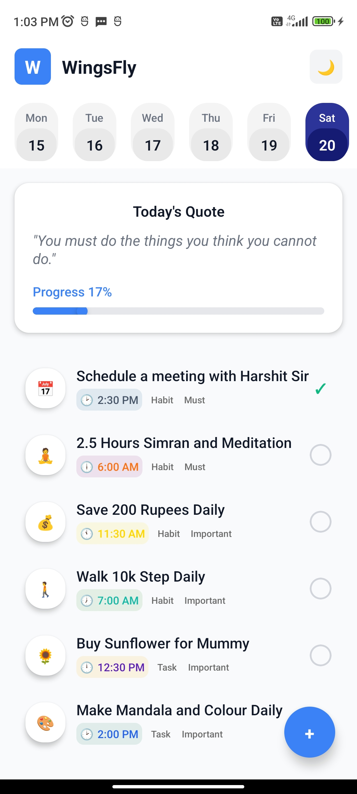
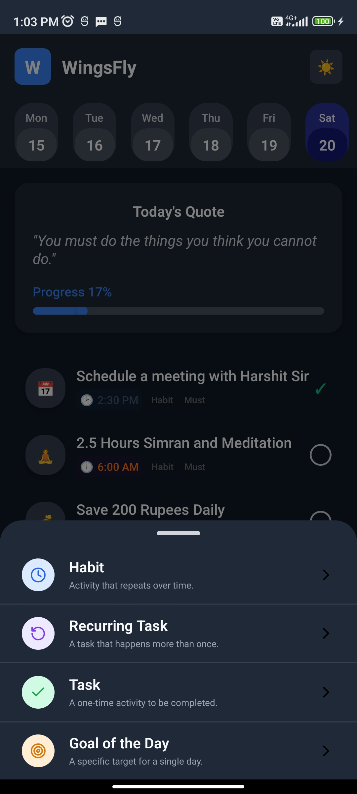
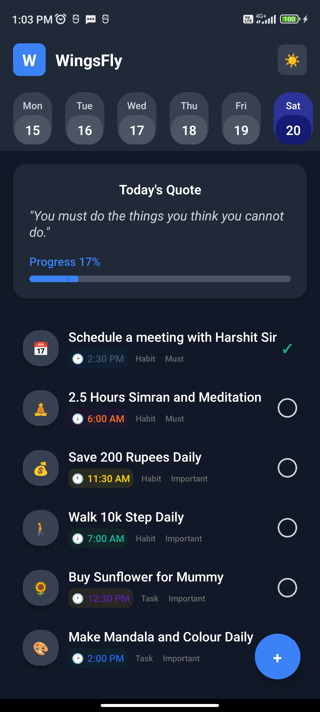
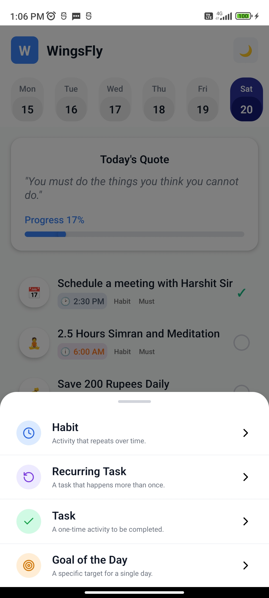

## WingsFly – React Native Task Manager UI

This project is a recreation of a mobile task manager **Home Screen** UI, developed as part of a Fresher Developer assessment. The application is built using React Native CLI and TypeScript, with a strong focus on creating a modular architecture, implementing smooth animations, and ensuring UI accuracy based on the provided Figma design.

---

### 📸 Screenshots

#### Light Mode  




#### Dark Mode  




---

### ✨ Features

- **Accurate UI Recreation**  
  Closely matches the provided Figma design.

- **Modular Component Architecture**  
  Reusable components: `TaskItem`, `DateButton`, `BottomDrawer`, etc.

- **Functional Task Management**  
  - Tap the circle/check icon to toggle task completion.  
  - “Today’s Quote” progress bar updates dynamically.

- **Animated Bottom Drawer**  
  Slide-up modal using React Native’s standard `Modal` component.

- **Dark Mode Support**  
  Toggle between light and dark themes.

---

### 🛠️ Tech Stack & Libraries

- **Framework:** React Native CLI  
- **Language:** TypeScript  
- **Styling:** `StyleSheet.create` (co‑located styles)  
- **Icons:** `lucide-react-native` + `react-native-svg`  
- **State Management:** React Hooks (`useState`, `useMemo`)

---


### 📁 Folder Structure

/src
├── components
│   ├── BottomDrawer.tsx
│   ├── CheckIcon.tsx
│   ├── CircleIcon.tsx
│   ├── DateButton.tsx
│   └── TaskItem.tsx
└── screens
    └── WingsFlyScreen.tsx


---

### 🚀 Setup & Installation

#### Prerequisites

* **Node.js** (LTS)
* **Watchman** (macOS)
* **React Native CLI** environment

#### Steps

1. **Clone the repo**

   ```bash
   git clone https://github.com/your-username/your-repo-name.git
   cd your-repo-name
   ```

2. **Install dependencies**

   ```bash
   npm install
   # or
   yarn install
   ```

3. **Install iOS pods**

   ```bash
   cd ios
   pod install
   cd ..
   ```

4. **Run the app**

   * **Android:**

     ```bash
     npx react-native run-android
     ```
   * **iOS:**

     ```bash
     npx react-native run-ios
     ```

---

### 🔑 Key Decisions & Assumptions

1. **State Management**
   Used React’s `useState` & `useMemo` for simplicity—no Redux/Zustand.

2. **Styling**
   Standard `StyleSheet.create` for performance and organization.

3. **Animations**
   Leveraged `Modal` with `animationType="slide"` instead of heavy libraries.

4. **Icons**
   Chose **lucide-react-native** for its high-quality SVG set (requires `react-native-svg`).

5. **Assumptions**

   * The Figma design is the source of truth for colors, fonts, and spacing.
   * Interactive behaviors follow standard UX patterns for task apps.

---

